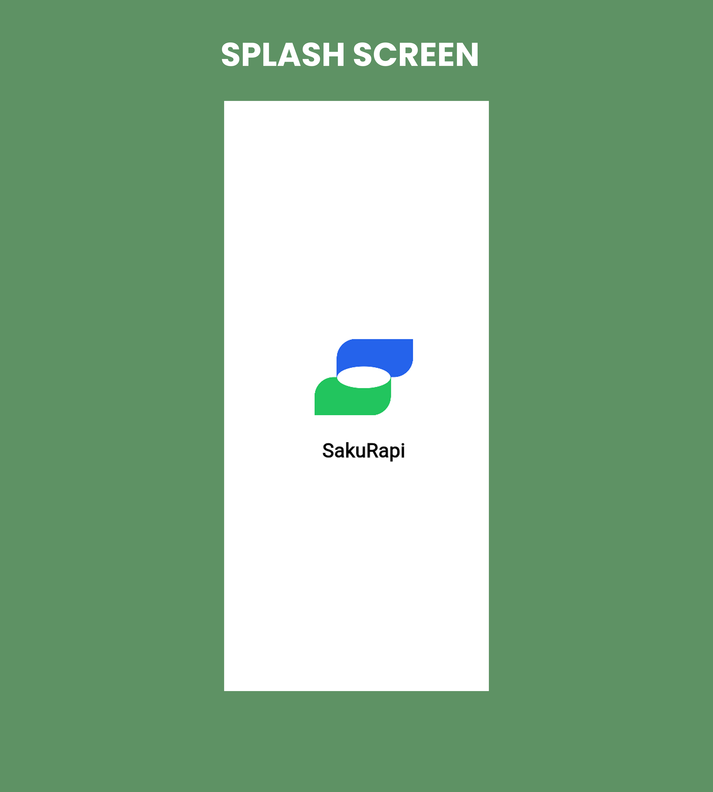

# Biodata Mahasiswa — Individual Project

## Identitas
- **Nama:** Muhammad Afif Khosyidzaki  
- **Kelas:** SIB-3G  
- **NIM:** 2341760159  
- **Nomor ID:** 14

## Tentang Saya
Saya mahasiswa Program Studi Sistem Informasi Bisnis di Politeknik Negeri Malang. Saat ini mengikuti mata kuliah Pemrograman Mobile dan aktif mengembangkan aplikasi berbasis Flutter. Saya tertarik pada pengembangan perangkat lunak dan aplikasi mobile, serta ingin terus mengasah kemampuan praktis saya melalui proyek nyata.

## Kontak
- Email: afifkhosyidzaki@gmail.com  

---

## Tentang Proyek
Proyek ini adalah aplikasi Flutter sederhana untuk tugas mata kuliah Pemrograman Mobile. Tujuan proyek: belajar struktur proyek Flutter, state management dasar, dan pembuatan UI yang responsif.

## Fitur
- Tampilan biodata mahasiswa
- Struktur proyek Flutter siap dikembangkan
- Contoh navigasi dan layout dasar


# 💰 Saku Rapi

*Aplikasi Flutter untuk mencatat dan menganalisis pengeluaran pengguna.*

---

<!-- OPTIONAL: Letakkan logo/banner di folder `assets/screenshots/` lalu ganti path di bawah ini -->

<!--  -->

<p align="left">
  <!-- Badges (opsional, boleh kamu hapus) -->
  <a href="https://flutter.dev/"></a>
  <a href="https://dart.dev/"></a>
  <a href="#"></a>
</p>

---

## 🧭 Deskripsi Singkat

**Saku Rapi** adalah aplikasi keuangan pribadi berbasis Flutter yang membantu pengguna mencatat, mengelola, dan menganalisis pengeluaran mereka secara efisien. Aplikasi dirancang dengan antarmuka yang sederhana namun informatif, sehingga pengguna dapat memahami alur keuangan harian dengan cepat.

> **Repo:** `apip2pipp/individual-project-3g-apip2pipp`

---

## 🔗 Demo & Screenshot

> Contoh: **Demo Web:** [https://example.com](https://example.com)
> Contoh: **Video Demo:** [https://youtu.be/xxxxxxxxxxx](https://youtu.be/xxxxxxxxxxx)

**Penempatan Screenshot**

* Simpan gambar di: `assets/screenshots/`
* Gunakan path relatif di README: ``
* Untuk grid screenshot:

```html
<p align="left">
  
  
  
</p>
```

---

## 🖼️ App Preview

### 🪪 Logo

<p align="center">
  
</p>

> **Deskripsi:**
> Logo Saku Rapi dibangun dari dua bentuk utama: hijau (keuangan real pengguna) dan biru (bantuan analisis yang terpercaya). Keduanya bertemu di ruang putih — ruang yang bersih, jujur, dan mudah dipahami.
> Hijau mewakili pertumbuhan finansial sehari-hari. Biru mewakili kendali dan ketenangan dalam mengambil keputusan. Putih di tengah merepresentasikan transparansi: tidak ada lagi pengeluaran yang “hilang entah kemana,” semuanya terang.
>Filosofinya sederhana: uangmu aman, jelas, dan di bawah kendali kamu. **Saku Rapi**.

---

### ⚡ Splash Screen

<p align="center">
  
</p>

> **Deskripsi:**
> Tampilan pertama ketika aplikasi dibuka. Splash menampilkan logo aplikasi beberapa detik sebelum menuju onboarding atau login.
> Transisi umumnya diatur menggunakan `Future.delayed` kemudian `Navigator.pushReplacement` menuju halaman berikutnya.

---

### 🚪 Onboarding
<p align="center">
  
</p>

> **Deskripsi**
> Layar onboarding memperkenalkan fungsi utama SakuRapi sebelum pengguna mulai memakai aplikasi.  
> Setiap slide menjelaskan manfaat inti aplikasi:
> - **Pantau Pengeluaran** – Catat setiap pengeluaran harian dengan cepat; tahu uangmu lari ke mana.
> - **Data Aman & Ekspor** – Data disimpan secara lokal di perangkat. Laporan bisa diekspor kapan saja ke PDF untuk dibagikan.
> - **Target & Peringat** – Pasang target pengeluaran/tabungan dan dapatkan peringatan saat hampir melewati batas.
> - **Kategori Fleksibel** – Buat dan atur kategori sendiri (makan, transport, hobi, dll.) sesuai gaya hidupmu.
> - **Insight yang Jelas** – Grafik ringkas membantu melihat pola belanja dan area paling boros.
> - **Anggaran Terkontrol** – Tetapkan anggaran bulanan dan pantau sisa anggaran secara real-time agar belanja lebih terarah.
>
> Onboarding ini juga langsung menyediakan dua tindakan utama di bagian bawah:  
> `Daftar Gratis` untuk membuat akun lokal baru dan `Masuk` untuk pengguna yang sudah pernah tercatat.  
> Versi aplikasi (misal `Versi 1.0`) ditampilkan agar pengguna tahu build yang sedang digunakan.

---

### 🔑 Login / Register
<p align="left">
  
  
</p>

> **Deskripsi:** Autentikasi lokal untuk tiap pengguna.

---

### 🏠 Home & Daftar Pengeluaran
<p align="center">
  
</p>

> **Deskripsi:** Ringkasan saldo & daftar transaksi terbaru.

---

### ➕ Tambah/Edit Pengeluaran
<p align="center">
  
  
</p>

> **Deskripsi:** Form transaksi dengan kategori, tanggal, dan catatan.

---

### 📊 Statistik
<p align="center">
  
</p>

> **Deskripsi:** Grafik & ringkasan per periode.

---

### 🧾 Ekspor PDF
<p align="center">
  
</p>

> **Deskripsi:** Hasil ekspor laporan pengeluaran ke format PDF.


---

## 🌟 Fitur Utama

* 🧾 **Catat Pengeluaran** – tambah, edit, hapus dengan kategori.
* 🗂️ **Manajemen Kategori** – buat dan kelola kategori sesuai kebutuhan.
* 📊 **Statistik** – ringkasan mingguan & bulanan, grafik sederhana.
* 👥 **Multi-User (Lokal)** – profil pengguna dan pengeluaran bersama (*shared expense*).
* 🔐 **Autentikasi Dasar** – login/register, lupa kata sandi (simulasi lokal).
* 🧮 **Ekspor PDF** – cetak laporan pengeluaran ke PDF.
* ⚙️ **Pengaturan** – ubah profil, ganti password, preferensi tampilan.

> **Catatan:** Fitur mengikuti struktur kode pada direktori `lib/screens` & `lib/services` (lihat **Struktur Proyek**).

---

## ⚙️ Teknologi yang Digunakan

* **Flutter SDK** + **Dart**
* **Shared Preferences** – penyimpanan lokal sederhana
* **Provider** (atau setara) – manajemen state
* **intl** – format tanggal & mata uang (IDR)
* **pdf & printing** – ekspor laporan ke PDF
* **path_provider** – akses direktori lokal

> Sesuaikan daftar ini dengan `pubspec.yaml` bila kamu menambah/mengganti paket.

---

## 🧰 Prasyarat

* **Flutter** (stable 3.x) & **Dart 3.x** terpasang
* SDK platform sesuai target (Android/iOS/Web/Desktop)
* Perangkat/Emulator aktif

Cek versi:

```bash
flutter --version
```

---

## 🚀 Instalasi & Menjalankan

```bash
# 1) Clone repository
git clone https://github.com/apip2pipp/individual-project-3g-apip2pipp.git

# 2) Masuk direktori
cd individual-project-3g-apip2pipp

# 3) Install dependency
flutter pub get

# 4) Jalankan (pilih salah satu device)
flutter run                    # otomatis memilih device aktif
flutter run -d chrome          # Web
flutter run -d android         # Android emulator / device
flutter run -d windows         # Windows Desktop
```

### Build Rilis (opsional)

```bash
# Android (APK release)
flutter build apk --release

# Web (release)
flutter build web --release
```

---

## 🗂️ Struktur Proyek (Ringkas)

```
lib/
 ├── main.dart
 ├── models/              # Model data (category, expense)
 ├── screens/             # UI screens (home, login, statistics, dll.)
 ├── services/            # Logika bisnis (auth, expense, pdf export)
 └── utils/               # Utility (format tanggal, rupiah, dll.)

assets/
 ├── auth/
 ├── icon/
 ├── onboarding/
 └── screenshots/         # <— taruh screenshot README di sini

# Lihat repo untuk struktur lengkap lintas platform (android, ios, web, windows, dll.)
```

> Struktur lengkap platform tersedia di repo (Android/iOS/Web/Desktop). File penting: `pubspec.yaml`, `analysis_options.yaml`, `README.md`.

---

## 🧪 Modul Penting

* `lib/services/expense_service.dart` – CRUD pengeluaran & perhitungan ringkas
* `lib/services/pdf_export_service.dart` – generator PDF laporan
* `lib/services/shared_expense_service.dart` – pengeluaran bersama (multi-user)
* `lib/services/auth_service.dart` – autentikasi lokal sederhana
* `lib/screens/statistics_screen.dart` – statistik & grafik ringkas

---

## 🧑‍💻 Panduan Singkat Penggunaan

1. **Onboarding & Splash** → kenalkan fitur inti.
2. **Registrasi/Log Masuk** → buat akun lokal (disimpan di perangkat).
3. **Tambah Pengeluaran** → isi nominal, kategori, tanggal, catatan.
4. **Lihat Statistik** → pantau ringkasan & tren per periode.
5. **Ekspor PDF** → buat laporan dan simpan/bagikan.

---

## 🔧 Konfigurasi Aset (opsional untuk di dalam aplikasi)

Tambahkan aset ke `pubspec.yaml` jika digunakan di **aplikasi** (tidak wajib untuk README):

```yaml
flutter:
  assets:
    - assets/auth/
    - assets/icon/
    - assets/onboarding/
    # Screenshot untuk README tidak perlu didaftarkan
```

---

## 🧯 Troubleshooting

* **Masalah dependency**: jalankan `flutter pub cache repair` lalu `flutter pub get`.
* **Device tidak terdeteksi**: cek `flutter devices`, pastikan emulator/USB debugging aktif.
* **Error izin Android**: pastikan `AndroidManifest.xml` memiliki izin Internet bila perlu.
* **Masalah font/format rupiah**: pastikan paket `intl` telah ditambahkan dan diinisialisasi.

---

## 🗺️ Roadmap (Ringkas)

* [ ] Sinkronisasi cloud (Firestore / Supabase) (opsional)
* [ ] Impor/ekspor CSV
* [ ] Kustom kategori dengan ikon
* [ ] Filter & pencarian lanjutan
* [ ] Dark mode menyeluruh

---

## 🤝 Kontribusi

Kontribusi terbuka untuk perbaikan bug, dokumentasi, atau pengembangan fitur.

1. Fork → 2) Buat branch fitur → 3) Commit → 4) Pull Request.

---

## 👥 Kontributor

* **Apip** — Developer utama
  *Politeknik Negeri Malang, Teknologi Informasi*

---

## 🛡️ Lisensi

Rilis di bawah **MIT License**. Silakan lihat file `LICENSE` untuk detail.

---

> 🧠 *“Kelola uangmu dengan rapi, maka hidupmu pun ikut teratur.”*
> Dibangun dengan ❤️ menggunakan Flutter.
